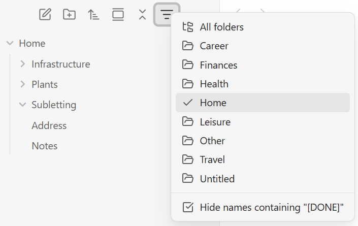

# File Explorer Filter

Plugin for Obsidian to provide filtering on top-level folders in the File explorer.

## Overview

File Explorer Filter adds a filter button to Obsidian's File explorer to switch the view between All folders or one specific top-level folder. Switch context without maintaining multiple notebooks - like OneNote sections.



### Features

- **Switch Folder Context**: Easily switch visual context between folders while staying in the same notebook.
- **Completed Notes**: Hide completed notes using a customizable pattern, such as `[DONE]`.
- **CSS-Based**: Use filtering alongside other File explorer plugins, including Drag and Drop Sort.
- **Non-Destructive**: Keep hidden items available through search, links, backlinks, and the quick switcher.

## Installation

### Community Plugins

Open **Settings → Community plugins → Browse**, search for **File Explorer Filter**, then select **Install** and **Enable**.

### Manual

1. Build the plugin:

  ```bash
  cd src
  npm install
  npm run build
  ```

2. Copy `src/dist/main.js`, `manifest.json`, and `src/styles.css` into `.obsidian/plugins/file-explorer-filter/`.

3. Enable **File Explorer Filter** under **Settings > Community plugins**.

## Usage

Select the filter icon in the File explorer toolbar, then choose **All folders** or a top-level folder such as **Career**. You can independently toggle **Hide names containing "[DONE]"**.

Under **Settings > File Explorer Filter**, enable or disable the name-filter menu option and replace `[DONE]` with any non-empty text. Name matching is case-insensitive and can occur anywhere in a file or folder name; empty or whitespace-only settings are rejected.

You can also use the command palette commands **File Explorer Filter: Show File Explorer Filter menu** and **File Explorer Filter: Toggle files and folders matching the name filter**.


## How it Works

When the plugin loads, it waits for the workspace layout and then applies the saved folder and name filters to every File explorer view. It also reruns this setup when Obsidian rebuilds the explorer, and refreshes the view when files are created, deleted, or renamed.

The filter keeps explorer rows in the DOM and applies a CSS class to rows outside the selected folder or matching the configured name pattern. When the filter changes, the view is refreshed; switching folders also invalidates Obsidian's virtual-scroll layout so the visible rows are recalculated immediately. The plugin does not patch `getSortedFolderItems()` or alter vault files, so it remains independent from explorer sorting plugins.

## Versioning and Releases

This plugin is built and released using [the repository's `release.yml` workflow](.github/workflows/release.yml). It is versioned using [Semantic Versioning](https://semver.org/).

It is published as a community plugin, with release assets published to a corresponding GitHub Release:

- [GitHub Releases](https://github.com/summerdawn-ai/obsidian-file-explorer-filter/releases)
- [File Explorer Filter on Community plugins](https://community.obsidian.md/plugins/file-explorer-filter)

## Development

The TypeScript source lives in `src/`. Run the plugin in watch mode while developing:

```bash
cd src
npm install
npm run dev
```

Run `npm run build` for a production build.

### Chrome DevTools

To inspect the plugin in Obsidian's live renderer, close any running Obsidian instance and start it with remote debugging enabled:

```powershell
& "C:\Program Files\Obsidian\Obsidian.exe" --remote-debugging-port=9222
```

1. Confirm that the renderer is available at [http://127.0.0.1:9222/json/list](http://127.0.0.1:9222/json/list).
2. Attach a Chrome DevTools MCP or CDP client to the `webSocketDebuggerUrl` returned for the renderer target.
3. Evaluate JavaScript inside Obsidian's live renderer.

The `--remote-debugging-port` switch is documented in [Electron's command-line switch reference](https://www.electronjs.org/docs/latest/api/command-line-switches), and the `/json/list` endpoint and `webSocketDebuggerUrl` are part of the [Chrome DevTools Protocol](https://chromedevtools.github.io/devtools-protocol/).

## Contributing

Contributions are welcome. Please fork the repository, create a focused branch for your change, and open a pull request with a clear description of what changed and why; issues are also welcome for bug reports and feature ideas.

## Security

We welcome responsible security reports. Please contact the repository owner privately with the details rather than opening a public issue, so the problem can be investigated and addressed before it is disclosed.

## License

This project is licensed under the MIT License - see the [LICENSE.md](LICENSE.md) file for details.
